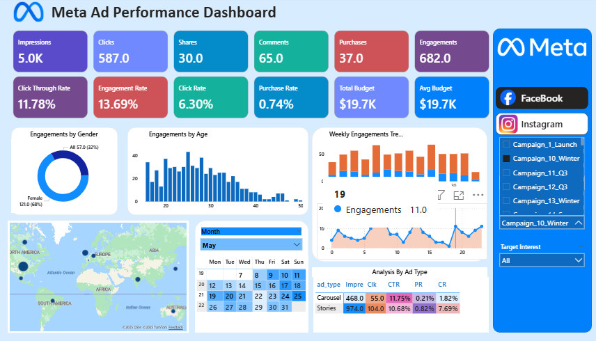

Meta Ads Performance Dashboard (Facebook & Instagram)

Power BI | Data Visualization | Marketing Analytics

Interactive Power BI dashboard analyzing ad performance across Facebook and Instagram.

📊 Project Overview

This Meta Ads Performance Dashboard provides a comprehensive, real-time view of advertising KPIs across Facebook and Instagram, empowering marketers and agencies to optimize campaigns with data-driven insights.

Built entirely in Power BI, the dashboard integrates key metrics, demographic breakdowns, geographic trends, and ad format performance into a single interactive interface.

🚀 Key Features

Feature	Description

KPIs at a Glance	Impressions, Clicks, CTR, Purchase Rate, Budget, Engagements
Demographic Insights	Impressions by Gender & Age (Pie + Bar Charts)
Geographic Distribution	Interactive world map with regional performance
Time-Based Trends	Weekly & Hourly Impressions + Calendar Heatmap
Ad Format Analysis	Carousel, Image, Stories, Video – with CTR, PR, CR
Dynamic Filters	Campaign Name, Platform, Date Range, Target Interest

📈 Sample Insights (May Campaign)

Metric	Value

Total Impressions	216,000

Total Clicks	25,400

Click-Through Rate (CTR)	5.21%

Purchase Rate	0.61%

Total Budget	$2.5M

Avg. Budget per Campaign	$50.7K

Top Performing Ad Format: Carousel

CTR: 12.33%
Conversion Rate (CR): 4.70%
Impressions: 127,560
Recommendation: Scale carousel ads targeting 25–34 age group during peak hours (8–10 PM).

🛠 Tech Stack

Power BI Desktop – Data modeling, DAX, visuals

DAX Measures – Dynamic KPIs, YoY/MoM calculations

Custom Visuals – Calendar heatmap, enhanced tooltips

Data Sources – Simulated Meta Ads Manager export (CSV)
